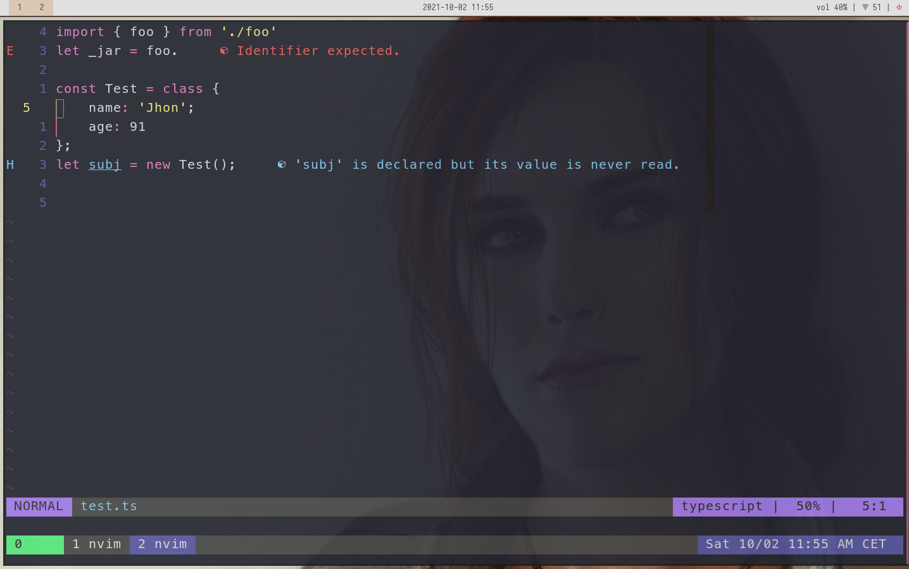

# fedora+i3 dotfiles

--- 

#### Oct 2, 2021,
* Mainly nvim and tmux tweaks, back to square one.
* Removed coc
* Configured lsp using [lsp-conf](https://github.com/neovim/nvim-lspconfig)
* Trying out Dracula colorscheme (sorry Gruvbox)
* Plans for the future: 
    * [completion](https://github.com/hrsh7th/nvim-cmp) 
    * [lspsaga](https://github.com/glepnir/lspsaga.nvim)
    * [telescope](https://github.com/nvim-telescope/telescope.nvim)
    * fzf, nvim-tree, lualine ...

What I achieved so far

---

- i3[wm](https://i3wm.org/)
    - Launcher [rofi](https://github.com/davatorium/rofi)
    - Status bar [polybar](https://github.com/polybar/polybar)
    - Compositor [picom](https://github.com/yshui/picom)
    - Terminal [urxvt](http://software.schmorp.de/pkg/rxvt-unicode.html)
    - Term Multiplexer [tmux](https://github.com/tmux/tmux)
    - [nvim](https://github.com/neovim/neovim) 
        - [coc](https://github.com/neoclide/coc.nvim) (will upgrade to native Lsp)
         - Pluging manager [vim-plug](https://github.com/junegunn/vim-plug)
         - Fuzzy search [fzf](https://github.com/junegunn/fzf.vim)
- Themes [gruvbox(community edition)](https://github.com/gruvbox-community/gruvbox) (for everything) 
